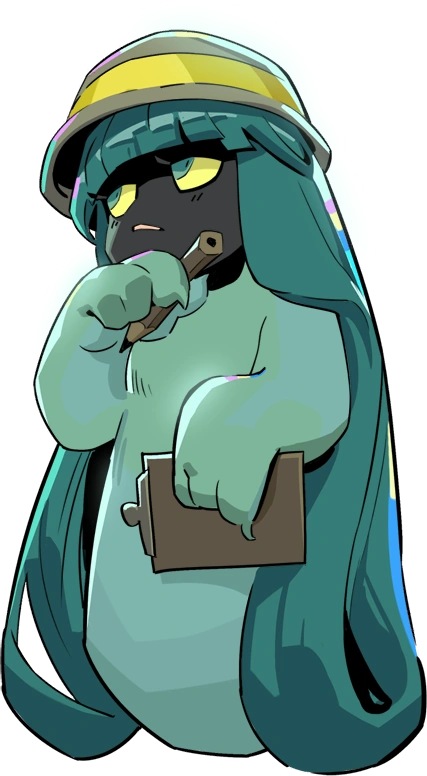
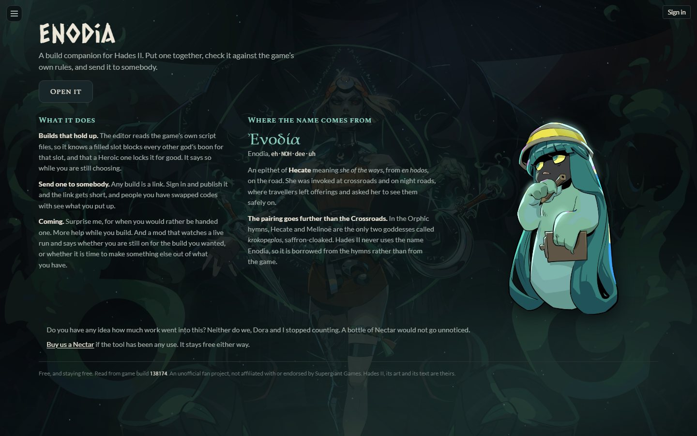
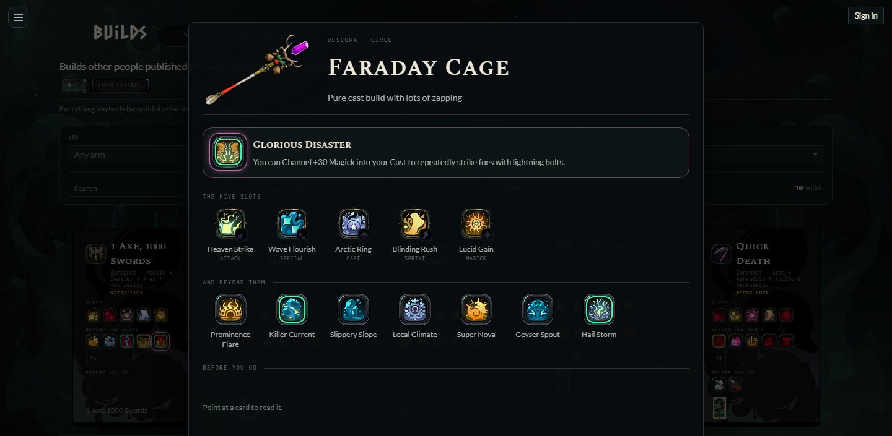
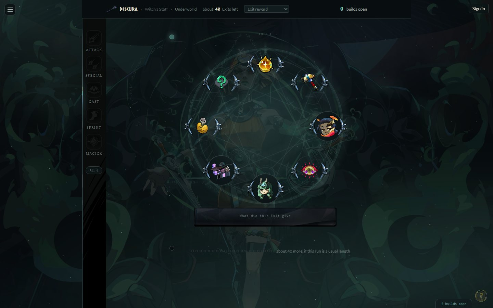
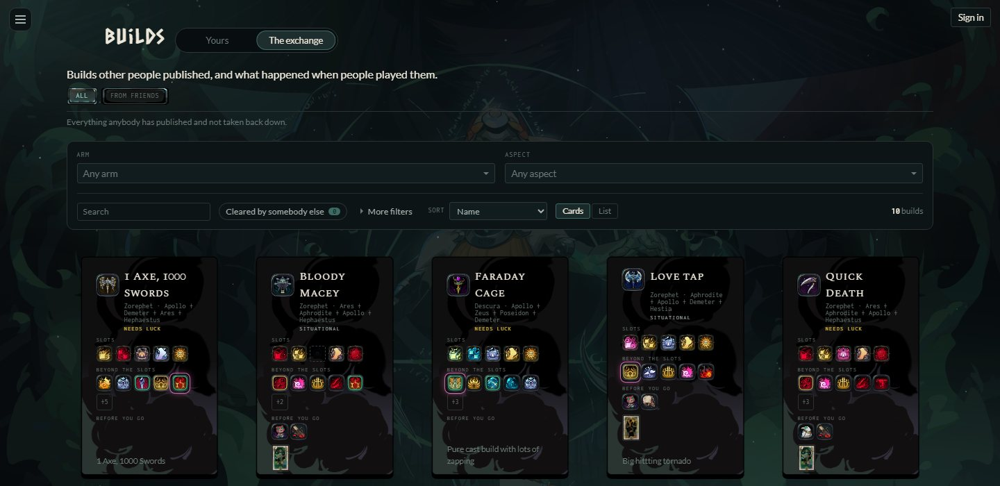
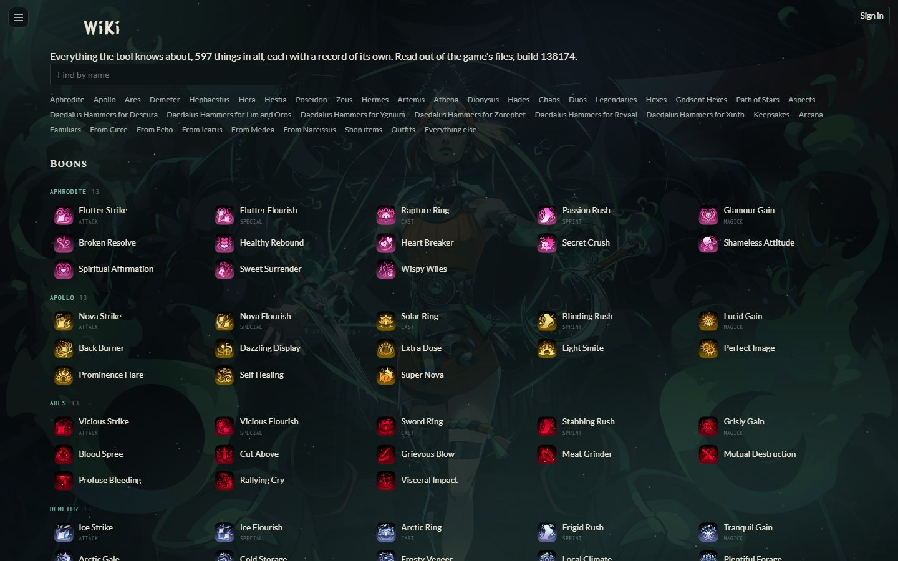

<p align="center">
  
</p>

<h1 align="center">Enodia</h1>

<p align="center">
  <b>A build companion for Hades II</b><br>
  Put a build together, check it against the game's own rules, and send it to somebody.<br>
  Then log a run Exit by Exit, and see which builds are still open after each pick.
</p>

<p align="center">
  <a href="https://enodia.me"></a>
  
  
  
</p>

<p align="center">
  <a href="#what-it-does">What it does</a> ·
  <a href="#use-it">Use it</a> ·
  <a href="#what-it-keeps-about-you">What it keeps about you</a> ·
  <a href="#building-from-source">Building from source</a>
</p>

> *"Log each Exit as you take it. That is the whole job, and it is the only thing I will ask of you."*
> Dora, your guide in the app



## What it does

### Reads the game, not a wiki

Hades II ships its logic as plain-text Lua, and Enodia is built from those files and nothing else. So it knows
that a filled slot blocks every other god's Boon for that slot, that a Heroic Boon locks its slot for good, that
the four-Olympian cap only governs which gods an Exit offers at random, and what each Boon's numbers are at every
rarity. When a game patch changes something, the data is read out again and the differences are checked before
they ship.

### Builds that hold up

Pick the five slot Boons, what else you want beyond them, your Daedalus Hammer upgrades and your Arcana. The
editor tells you what cannot happen together, and reads out how much luck the whole build needs and where that luck
goes. A build that asks for two exact Hammer upgrades on one arm is lovely the once and less lovely on the tenth
run, and it says so.



### Follows a run

Set up a run with an arm, an aspect and a route, and log what each Exit gave. The timeline records what each pick
closed, at the pick that closed it, not four Exits later. "Builds open" counts what is still reachable, and the
latest entry says which god still feeds each one. Leave and come back, and a card says what you were chasing and
where it stands. Took the wrong entry? Take it back, and everything after it is worked out again.



### Share and compare

Every build is a link, with no account needed. Sign in and publish it, and the link gets short enough for a
Discord message. **The exchange** lists what everybody published, with how often people cleared it and at what
Fear. Add friends by swapping a code, and see what they put up. There are leaderboards, and **guides**: writing
with builds named inside it, which read differently in the middle of a run than at the start.



### And also

- **A wiki of everything the tool knows about:** 597 Boons, Hammers, Arcana, keepsakes, familiars and more, each
  with its own page and its numbers read from the game's files.
- **The Arcana board** in the game's own positions, with your Grasp as the budget.
- **Four looks:** the game's own art, or three styles the browser draws. Plus themes for colours, weather and
  wallpaper. None of it changes how anything works.
- **A tour on every page**, by Dora, who would like you to know she did not pick the hat.



## Use it

Open **[enodia.me](https://enodia.me)**. There is nothing to install, and no account is needed for anything
except publishing, friends and keeping your library on more than one device. It works on a phone as well as a
desktop.

## What it keeps about you

Enodia is built so you can check exactly what it does. In short:

| Where | What |
|---|---|
| Your browser | Your builds, your runs, your settings and your display name, in local storage. Nothing leaves the browser unless you sign in or send a link somewhere. **Settings → Export** writes all of it to one file, which is the only backup there is if you never sign in. |
| An account, if you make one | Your email address and display name, to sign in. Your builds, runs and settings are synced between your devices. Builds and guides you publish are public until you take them down. |
| A run against someone else's build | Whether you cleared it, and the Fear if you did, counted toward that build's listing. Your account is attached so nobody can count the same run twice, and it is never shown. A switch in **Settings** turns it off. |
| Email | Only for a password reset you asked for, sent through Resend. |
| Anybody else | Nothing. No analytics, no tracking, no third-party fonts or scripts. The Content Security Policy only lets the page talk to enodia.me itself. |

The code for this lives in [`worker/`](worker), the account and sync side, and
[`assets/_headers`](assets/_headers), which carries the security policy.

## Building from source

Needs Node 22 or later. The game data is already extracted and checked in, so Hades II is only needed to read it
out again after a patch.

```sh
npm ci
npm run dev       # the app on port 5173
npm test          # tests in node, and the backend inside workerd against a local database
npm run build     # validates the game data first, then builds into dist/
```

| Path | What |
|---|---|
| `src/` | The app (React 19, TypeScript, Vite) |
| `worker/` | The API under `/api/*`, on Cloudflare Workers with D1 |
| `scripts/` | The extractor that runs the game's Lua, and the validator that checks what it read |
| `data/` | Extracted game data, and the hand-written layer on top of it |
| `assets/` | The image library, see [assets/README.md](assets/README.md) |

More in [docs/development.md](docs/development.md). Where the project stands is in [ROADMAP.md](ROADMAP.md), and
the rules it is built by are in [CLAUDE.md](CLAUDE.md).

## Feedback and support

Found a Boon with the wrong number, or a build it calls out of reach that you have put together?
[Open an issue](https://github.com/Stigsmith/Enodia/issues).

Enodia is free and staying free. If it has been any use, you can
[buy us a Nectar on Ko-fi](https://ko-fi.com/stigsmith).

## Licence

All rights reserved, see [LICENSE](LICENSE). The source is published to be read. Enodia is an unofficial fan
project, not affiliated with or endorsed by Supergiant Games. Hades II, its art and its text belong to them.
